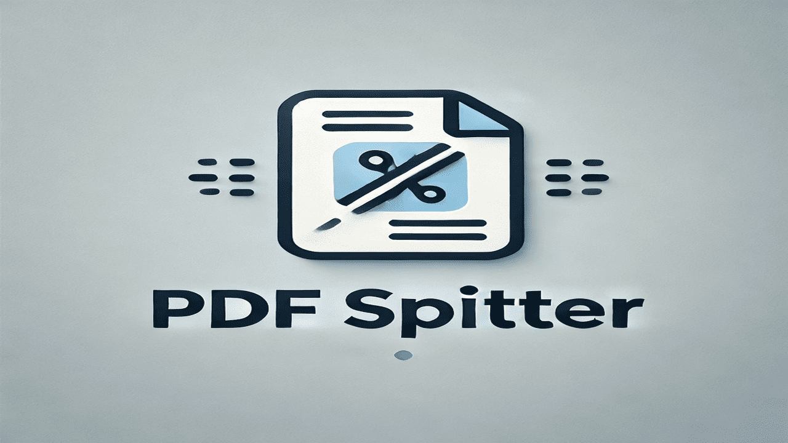

# PDF Splitter Web Application

[](https://opensource.org/licenses/MIT)
[](https://www.python.org/downloads/)
[](https://flask.palletsprojects.com/)

A web-based tool that allows users to split PDF files into multiple documents based on specified page ranges. Built with Flask and PyPDF2, featuring a clean and responsive user interface.

## Features

- 📤 PDF file upload
- ➗ Split PDFs by multiple page ranges
- ➕ Dynamically add/remove page ranges
- 📦 Download results as a ZIP file
- 🎨 Clean, responsive UI with Tailwind CSS
- ⚡ Asynchronous processing
- 🔒 Basic security features

## Installation

### Prerequisites

- Python 3.9 or higher
- pip (Python package installer)

### Local Setup

1. Clone the repository:

```bash
git clone https://github.com/yourusername/pdf-splitter.git
cd pdf-splitter
```

2. Create a virtual environment:

```bash
python -m venv venv
source venv/bin/activate  # On Windows, use: venv\Scripts\activate
```

3. Install dependencies:

```bash
pip install -r requirements.txt
```

4. Run the application:

```bash
python app.py
```

5. Open your browser and navigate to `http://localhost:5000`

## Usage

1. Upload a PDF file using the file input.
2. Add page ranges by specifying start and end pages.
3. Add more ranges using the "Add Range" button.
4. Remove unwanted ranges using the "Remove" button.
5. Click "Split PDF" to process the file.
6. Download the resulting ZIP file containing your split PDFs.

## Project Structure

```
pdf-splitter/
├── app.py                 # Main Flask application
├── requirements.txt       # Python dependencies
├── templates/
│   └── index.html        # Main HTML template
├── static/
│   └── js/
│       └── main.js       # JavaScript functions
└── README.md             # This file
```

## Technology Stack

- **Backend:**

  - Flask (Python web framework)
  - PyPDF2 (PDF processing library)
  - Werkzeug (WSGI web application library)

- **Frontend:**
  - HTML5
  - Tailwind CSS
  - JavaScript

## Customization

### Modifying the UI

The user interface is built with Tailwind CSS. To modify the styling:

1. Edit the classes in `templates/index.html`
2. Tailwind classes are processed at runtime using the CDN version

### Extending Functionality

To add new features:

1. Modify `app.py` to add new routes or enhance existing ones
2. Update the HTML template in `templates/index.html`
3. Add any new JavaScript functions to handle the UI interactions

Example of adding a new route:

```python
@app.route('/preview/<filename>')
def preview_pdf(filename):
    # Add your preview functionality here
    pass
```

### Configuration Options

Key configuration options in `app.py`:

```python
app.config['MAX_CONTENT_LENGTH'] = 16 * 1024 * 1024  # Max file size (16MB)
app.config['UPLOAD_FOLDER'] = tempfile.gettempdir()  # Upload directory
```

## Contributing

Contributions are welcome! Please feel free to submit a Pull Request.

1. Fork the repository
2. Create your feature branch (`git checkout -b feature/AmazingFeature`)
3. Commit your changes (`git commit -m 'Add some AmazingFeature'`)
4. Push to the branch (`git push origin feature/AmazingFeature`)
5. Open a Pull Request

## License

This project is licensed under the MIT License - see the [LICENSE](LICENSE) file for details.

## Acknowledgments

- [Flask](https://flask.palletsprojects.com/) - The web framework used
- [PyPDF2](https://pypdf2.readthedocs.io/) - PDF processing library
- [Tailwind CSS](https://tailwindcss.com/) - CSS framework
- All contributors who participate in this project

## Support

If you encounter any problems or have suggestions:

1. Check the [Issues](https://github.com/Abderahmanvt7/pdf-splitter-app/issues) page
2. Create a new issue if needed
3. Contact the maintainers

---

Made with ❤️ by [Abderahman HAMILI](https://github.com/Abderahmanvt7)
